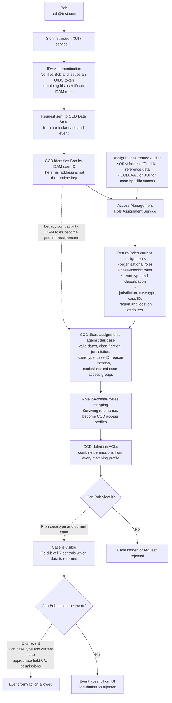

```mermaid
  flowchart TD
      Bob["Bob<br/>bob@test.com"]

      Bob --> Login["Sign in through XUI / service UI"]
      Login --> IDAM["IDAM authentication<br/>Verifies Bob and issues an OIDC token<br/>containing his user ID and IDAM roles"]

      IDAM --> Request["Request sent to CCD Data Store<br/>for a particular case and event"]
      Request --> Identity["CCD identifies Bob by IDAM user ID<br/>The email address is not the runtime key"]

      Identity --> RAS["Access Management<br/>Role Assignment Service"]
      RAS --> Assignments["Return Bob's current assignments<br/>• organisational roles<br/>• case-specific roles<br/>• grant type and classification<br/>•
      jurisdiction, case type, case ID,<br/>  region and location attributes"]

      Provisioning["Assignments created earlier<br/>• ORM from staff/judicial reference data<br/>• CCD, AAC or XUI for case-specific access"]
      Provisioning -.-> RAS

      Identity -. "Legacy compatibility:<br/>IDAM roles become pseudo-assignments" .-> Filter
      Assignments --> Filter["CCD filters assignments against this case<br/>valid dates, classification, jurisdiction,<br/>case type, case ID, region/
      location,<br/>exclusions and case-access groups"]

      Filter --> Profiles["RoleToAccessProfiles mapping<br/>Surviving role names become CCD access profiles"]

      Profiles --> ACL["CCD definition ACLs<br/>combine permissions from every matching profile"]

      ACL --> View{"Can Bob view it?"}
      View -->|"R on case type and current state"| Visible["Case is visible<br/>Field-level R controls which data is returned"]
      View -->|"No"| Hidden["Case hidden or request rejected"]

      Visible --> Event{"Can Bob action the event?"}
      Event -->|"C on event<br/>U on case type and current state<br/>appropriate field C/U permissions"| Allowed["Event form/action allowed"]
      Event -->|"No"| Blocked["Event absent from UI<br/>or submission rejected"]
```
