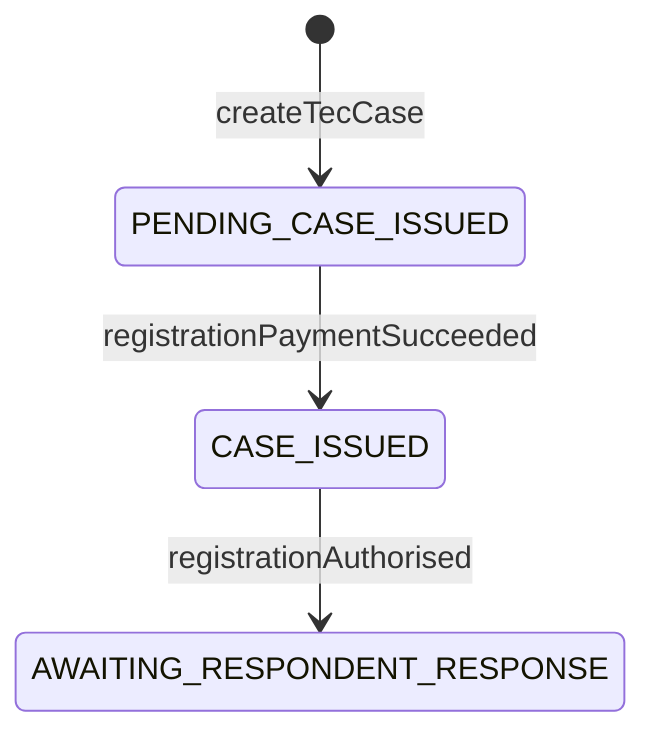
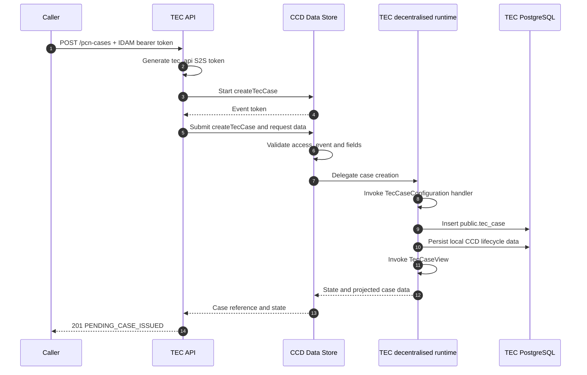
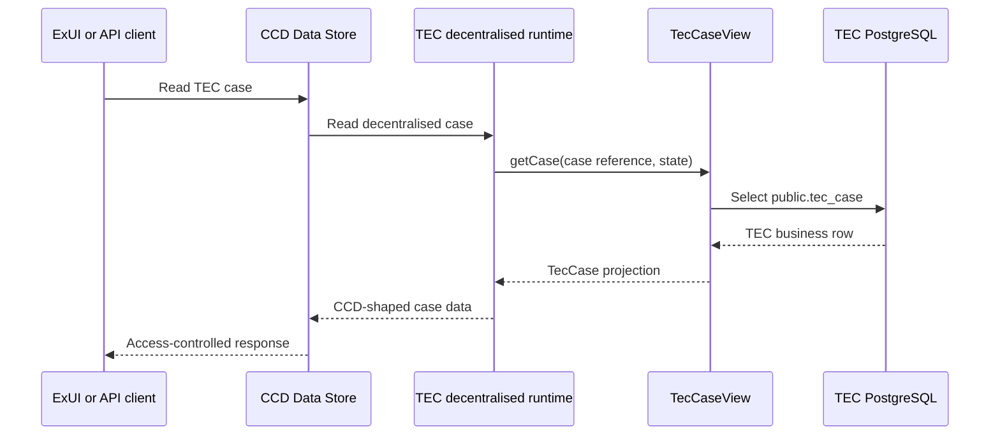

# TEC decentralised CCD architecture

This document describes the architecture implemented by this proof of concept. The repository is local-only: the
production topology below explains how the same components would fit together, but this repository does not deploy
them to an environment.

## Components

| Component | Responsibility | Where it runs |
| --- | --- | --- |
| TEC Spring Boot application | Exposes the caller-facing API, defines the `TEC` and `TEC_BATCH` case types, handles delegated CCD events and owns the PCN/batch business data | Port 4013 locally |
| `hmcts.ccd.sdk` Gradle plugin | Generates CCD definition JSON from the typed Java configuration | At build/configuration time |
| CCD decentralised runtime | Supplies `/ccd-persistence/**`, lifecycle persistence, event dispatch and `CaseView` integration | Embedded in TEC because `decentralised = true` |
| CCD Data Store and Definition Store | Validate the definition, enforce case access/events and route decentralised persistence to TEC | Started locally by CFTLib; platform services in production |
| CFTLib | Provides Gradle tasks and assembles the local CCD services, simulators and infrastructure | Local development only |

The central relationship is:

```text
The Java CCD configuration describes the contract.
CCD remains the case API and event orchestrator.
TEC owns the business data and handles delegated persistence.
CFTLib makes the integration runnable locally.
```

## TEC implementation

The relevant application classes are:

- `TecCase`: the CCD-facing PCN data model.
- `CaseState`: the four states generated into the CCD definition for PCN cases.
- `UserRole`: the system and clerk access profiles.
- `TecCaseConfiguration`: the PCN case type, access, tabs, Case File View categories, search/work-basket
  fields, events and Java event handlers.
- `CaseFileCategory`: document folders shown in the Case File View for PCN cases.
- `TecCaseDocument`: persisted Case File View document metadata.
- `TecCaseRepository`: persistence of TEC-owned business data in `public.tec_case`.
- `TecCaseView`: reconstruction of a CCD-facing `TecCase` from the business table.
- `TecCaseController` and `TecCaseCreationService`: the caller-facing create API and its CCD Data Store client.
- `BatchCase` / `BatchCaseState` / `BatchCaseConfiguration` / `BatchCaseView` / `BatchCaseRepository`:
  second case type `TEC_BATCH` for batches (list/details via ExUI Case list).
- `BatchCaseController` and `BatchCaseCreationService`: `POST /batches` seed/create API.

The application therefore has two API surfaces:

```text
Caller-facing API:       POST /pcn-cases , POST /batches
CCD-facing SDK runtime:  /ccd-persistence/**
```

The application owns the first. The embedded decentralised runtime supplies the second.

### Case types and access

Jurisdiction id is `TEC`. Case types:

| Case type id | Display name | Purpose |
| --- | --- | --- |
| `TEC` | TEC PCN | PCN cases |
| `TEC_BATCH` | TEC Batch | Uploaded batches |

Both types reuse the same roles:

| Java role | IDAM role | Case-type access | State access |
| --- | --- | --- | --- |
| `SYSTEM` | `caseworker-tec-system` | CRUD | CRUD in every state |
| `CLERK` | `caseworker-tec` | CRU | Create, read and update in every state |

Clerk **Create** is required so ExUI can start the Create batch (`uploadBatch`) journey. PCN create
remains system-only via the hidden `createTecCase` event (`NEVER_SHOW`).

ExUI Case list / Find case expose a **case type** filter. Fresh sessions preferably land on `TEC`
(import order + alphabetical id); ExUI may remember the last selection in `localStorage` — see
[exui-navigation.md](./exui-navigation.md).

Most system events use `[STATE]="NEVER_SHOW"`. Clerk-visible PCN events include `verifyFormValidation`
and `editApplication`. Create batch is the clerk-visible `uploadBatch` event on `TEC_BATCH`, linked
from ExUI primary nav (not as a case-scoped Next step).

### States and events



`CLOSED` is defined and has role access, but no configured event currently enters it. There is no payment-failure
event in the current implementation.

The event handlers update TEC-owned data as follows:

| Event | Required event data | Business write | Resulting state |
| --- | --- | --- | --- |
| `createTecCase` | Registration-request fields including local authority; respondent lines 4–6 are optional | Inserts `public.tec_case`; `payment_status` defaults to `PENDING` | `PENDING_CASE_ISSUED` |
| `registrationPaymentSucceeded` | `paymentReference` | Sets payment status to `SUCCEEDED` and stores the reference | `CASE_ISSUED` |
| `registrationAuthorised` | `registrationDocument` | Stores the document value and the application server's current date | `AWAITING_RESPONDENT_RESPONSE` |
| `attachCaseFileDocument` | `caseFileDocument` (CCD Document with `category_id`) | Inserts `public.tec_case_document` | unchanged |
| `recordApplication` | Optional TE9/PE3 OCR application fields | Upserts application columns on `public.tec_case` | unchanged |
| `editApplication` | Optional TE9/PE3 application fields (clerk) | Upserts application columns on `public.tec_case` | unchanged |
| `recordTimeExtension` | Optional TE7/PE2 time-extension fields | Upserts time-extension columns on `public.tec_case` | unchanged |

`attachCaseFileDocument` is system-only and hidden from ExUI (`NEVER_SHOW`). Local uploads use
`bin/attach-case-file-document.sh`, which posts the file to Case Document AM (`:4455`) then submits
this event. `TecCaseView` rebuilds `allDocuments` from `tec_case_document` so ExUI Case File View can
group files by category.

`recordApplication` is likewise system-only and hidden from ExUI. Integrations submit OCR-extracted
TE9 or PE3 fields via this event; Case details shows them under the **Applications** section.

`recordTimeExtension` is system-only and hidden from ExUI. Integrations submit OCR-extracted TE7 or
PE2 fields via this event; Case details shows them under a heading driven by the form
(**Application to file out of time** / **Application for extension of time** for TE7 by permission
sought; **Application to file out of time** for PE2).

`editApplication` is clerk-facing and appears in Manage Case Next steps. It presents all application
fields on a single page so caseworkers can correct OCR data.

Local CDAM expects dm-store on `:4506`. `bootWithCCD` starts `./bin/start-local-dm-store.sh`
automatically; CFTLib does not otherwise start dm-store under `AuthMode.Local`.

### Case presentation and search

`TecCaseConfiguration` generates three application tabs in addition to CCD's case-history tab:

- **Case details**: a **Registration** section containing identifiers, local authority, respondent lines, vehicle/offence details,
  certificate date, amount, and registration workflow fields (payment status/reference, closure reason, registration
  document and date); an application section headed by form and timeliness
  (**Witness statement** or **Statutory declaration**, each **In time** or **Out of time**) for a single
  shared form validation result plus OCR-extracted TE9/PE3 data (date received, type, form, PCN/VRN,
  applicant and address fields, declaration, and conditional fields such as TE7 submitted, PE3 reasons
  given, and TE9 payment details); and a time-extension section headed by TE7 permission sought
  (**Application to file out of time** or **Application for extension of time**) or
  **Application to file out of time** for PE2, covering form, PCN/VRN, respondent details, permission
  sought, reasons given, signed and dated, signed by, and related fields (form validation is the same
  shared case field shown at the top of the active section).
- **Case File View**: document viewer component. Folders are defined as CCD categories in
  `CaseFileCategory` (Hearing documents, Orders and notices of hearings, Applications,
  Correspondence, Uncategorised) and registered via `builder.categories(...)` in
  `TecCaseConfiguration`. Documents appear when `TecCaseView` exposes `allDocuments` from
  `tec_case_document` with matching `category_id` values.
- **Tasks**: prototype task list for local UX exploration.

Search and work-basket inputs are penalty charge number and local authority (CCD `FixedList` of the 2023
England councils — ExUI has no generic autosuggest for this control). Results include the case reference,
penalty charge number, local authority, respondent lines 1–3 and vehicle registration number.

The tab configuration is static CCD metadata. `TecCaseView` supplies the current values at runtime by loading the row
whose `case_reference` matches the CCD reference. ExUI and API clients call CCD; they do not call `TecCaseView`
directly.

### Prototype Tasks tab

The **Tasks** tab is declared in `TecCaseConfiguration` and rendered as HTML that approximates ExUI's Work
Allocation `exui-case-task` cards (priority, due date, assignee, Manage links and Next steps). It is not connected to
Work Allocation. `TecCaseView` populates `tasksMarkdown` so the tab can be used for prototyping layout without Camunda
or WA services.

| Piece | Location / behaviour |
| --- | --- |
| Tab config | `builder.tab("tasks", "Tasks")` with a label interpolating `${tasksMarkdown}` |
| Prototype HTML | `TecPrototypeTasks.markdownFor(caseRef, state, tecCase)` |
| Start-task links | Next steps links to `/cases/case-details/{ref}/trigger/{eventId}` (for example `verifyFormValidation`) |

When a case is in `CASE_ISSUED`, the tab shows a mix of unassigned, assigned-to-you and assigned-to-someone-else cards
so Manage and Next steps layouts can be compared.

Case-scoped Tasks HTML is not the place for Create batch. That belongs in ExUI primary
navigation via `menuConfigs` — see [exui-manage-batches-plan.md](./exui-manage-batches-plan.md) and
[exui-navigation.md](./exui-navigation.md). Existing batches are opened from Case list with case type
**TEC Batch** (`TEC_BATCH`).

### Batch case type (`TEC_BATCH`)

| Piece | Location / behaviour |
| --- | --- |
| Config | `BatchCaseConfiguration` — tabs History (SDK), Tasks, Batch details |
| States | `QUEUED_FOR_PROCESSING` → `PROCESSING_STARTED` → `PROCESSING_COMPLETE` |
| Persistence | `public.tec_batch` + `public.tec_batch_document` |
| Documents | Inputs and Outputs linked from Batch details (`BatchFileCategory`; no Case File View tab) |
| Search / work basket | Batch identifier, local authority, **Batch type** (`FixedList` of `BatchOperation`; ExUI empty option = any), received via |
| Create API | `POST /batches` (`bin/create-tec-batch.sh`) via hidden `createBatch` |
| Clerk Create batch | Visible `uploadBatch` multi-page event (nav deep link `/cases/case-create/TEC/TEC_BATCH/uploadBatch`) |
| Hidden events | `createBatch`, `startBatchProcessing`, `completeBatchProcessing`, `attachBatchDocument` |

#### Create batch journey (`uploadBatch`)

Clerk-facing wizard started from ExUI primary nav. Helpers live in `BatchUploadJourney`. Validation
copy and some submit metadata are still placeholders.

| Step | Page id | Notes |
| --- | --- | --- |
| Select batch type | `selectBatchType` | `FixedRadioList` of `BatchTypeOption` (label includes a short description); stored as `BatchOperation` |
| Before you start | `interstitial` | Placeholder guidance |
| Upload batch file | `uploadFile` | Mid-event sets placeholder excluded-PCN count |
| Some data cannot be processed | `validationResults` | Static HTML matching the design mock |
| Statement of truth | `statementOfTruth` | Contempt warning + checkbox (`MultiSelectList`); field label **Statement of truth** (also shown on Check your answers) |
| Check your answers | ExUI auto CYA | Enabled via `.showSummary()`; H1 is ExUI’s fixed “Check your answers”; Submit button label **Submit** |
| Confirmation | submit response | Header/body from `BatchUploadJourney`; case number and overnight-processing copy; **no** Manage cases body link |

Submit persists the batch (`repository.create`), attaches the uploaded document under Inputs when
present, and lands in `QUEUED_FOR_PROCESSING`.

#### Local setup

1. Start the CFTLib stack: `./gradlew bootWithCCD`
2. Create a case: `./bin/create-tec-case.sh`
3. Move it to `CASE_ISSUED`: `./bin/transition-to-case-issued.sh <case-reference>`
4. Sign in to Manage Case as `tec-demo@test.com` / `password` and open the case — the **Tasks** tab should list the tasks

## Definition generation and runtime

The relevant Gradle configuration is:

```groovy
ccd {
  configDir = file('build/ccd-definition')
  rootPackage = 'uk.gov.hmcts.reform.tecpoc'
  decentralised = true
  runtimeIndexing = false
}
```

`./gradlew generateCCDConfig` generates definitions under `build/ccd-definition/TEC` and
`build/ccd-definition/TEC_BATCH`. The JSON contains CCD metadata; it does not contain the Java handlers.
Existing files under `build/ccd-definition` are build output and may include remnants from an older
model unless the directory is cleaned first.

At runtime, the decentralised SDK:

- exposes the persistence and read callbacks used by CCD Data Store;
- dispatches submitted events to the handler registered with `decentralisedEvent(...)`;
- manages local CCD lifecycle data, revisions and event history in the `ccd` schema; and
- calls the matching `CaseView` (`TecCaseView` or `BatchCaseView`) for the case type.

Runtime Elasticsearch indexing is explicitly disabled.

## Create flow



TEC does not create a case by invoking its handler directly. `TecCaseCreationService` calls CCD's `startCase` and
`submitCaseCreation` APIs; the business insert happens when CCD delegates the event back to TEC.

## Read flow



## Local CFTLib topology

Run the local stack with:

```bash
./gradlew bootWithCCD
```

CFTLib starts the TEC application and real CCD service code in isolated classloaders, with Docker-based supporting
infrastructure and local IDAM/S2S simulators. The important local endpoints configured by this repository are:

| Service | Address |
| --- | --- |
| TEC API and callbacks | `http://localhost:4013` |
| CCD Data Store | `http://localhost:4452` |
| IDAM simulator | `http://localhost:5062` |
| S2S simulator | `http://localhost:8489` |
| Shared PostgreSQL server | `localhost:6432` |

The `tec` database is added to that PostgreSQL server. `TecCftLibConfiguration` then:

1. creates `caseworker`, `caseworker-tec-system` and `caseworker-tec` roles;
2. creates `tec-system@test.com` with system and clerk roles;
3. creates `tec-demo@test.com` with the clerk role;
4. generates and imports the `TEC` definition; and
5. creates a CCD profile for the demo user.

Local CCD routing is set on the CFTLib-launched services as:

```text
CCD_DECENTRALISED_CASE-TYPE-SERVICE-URLS_TEC=http://localhost:4013
```

In a production deployment, the equivalent route belongs to CCD Data Store configuration and points at the deployed
TEC service. The generated definition must also be imported through the environment's definition-release process.
CFTLib itself is not deployed.

## Source of truth

| Concern | Source of truth |
| --- | --- |
| Case type, fields, states, events, tabs, categories and permissions | `TecCaseConfiguration`, `BatchCaseConfiguration`, `CaseState` / `BatchCaseState`, `UserRole`, categories and case models |
| Definition used by the local CCD stack | Generated `build/ccd-definition/TEC` and `TEC_BATCH` imported by `TecCftLibConfiguration` |
| PCN business data | `tec.public.tec_case` |
| Batch business data | `tec.public.tec_batch` / `tec.public.tec_batch_document` |
| Case File View documents (PCN) | `tec.public.tec_case_document` |
| Batch documents (Case details links) | `tec.public.tec_batch_document` |
| Decentralised lifecycle metadata and event history | SDK-managed `tec.ccd` schema |
| Current CCD-facing field values | `TecCaseView` / `BatchCaseView` projection |
| Local users, roles and CCD profile | `TecCftLibConfiguration` |
| Prototype task list shown on Tasks tab | `TecPrototypeTasks` in `TecCaseView` |
| ExUI primary nav (e.g. Create batch) | ExUI `menuConfigs` — plan in `docs/exui-manage-batches-plan.md`; local proxy in `bin/xui-manage-batches-proxy.py` |
| Create batch wizard copy / confirmation | `BatchUploadJourney` |
| Local service URLs and CCD-to-TEC route | `build.gradle` and `application.yaml` |

## Repository map

- `build.gradle`: dependencies, CCD SDK settings, local CFTLib environment and test tasks.
- `src/main/java/uk/gov/hmcts/reform/tecpoc/ccd/`: case model, definition, handlers, view and repository.
- `src/main/java/uk/gov/hmcts/reform/tecpoc/http/`: caller-facing HTTP contract.
- `src/main/java/uk/gov/hmcts/reform/tecpoc/service/TecCaseCreationService.java`: CCD start/submit client.
- `src/main/resources/db/migration/V1__create_tec_case.sql`: TEC business schema.
- `src/cftlib/java/uk/gov/hmcts/reform/tecpoc/cftlib/TecCftLibConfiguration.java`: local setup and definition import.
- `bin/create-tec-case.sh`: local case-creation example.
- `bin/transition-to-case-issued.sh`: fires `registrationPaymentSucceeded` to move a case to `CASE_ISSUED`.
