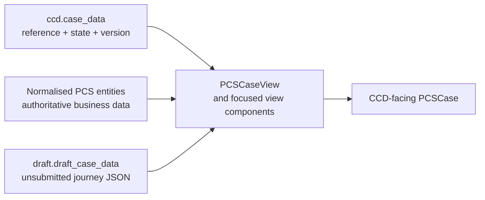
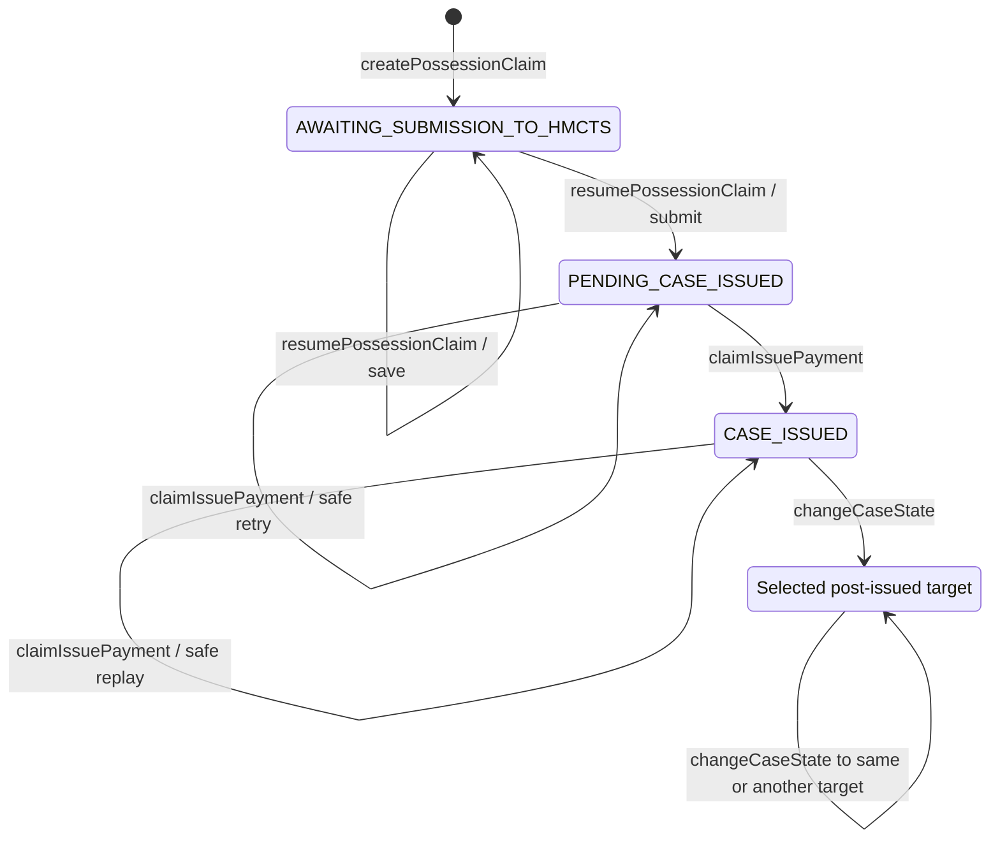
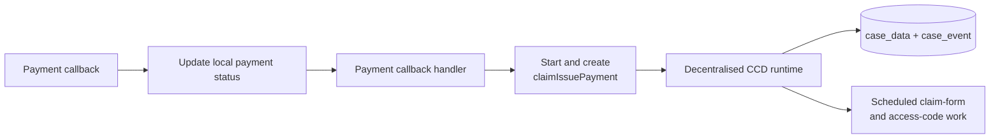
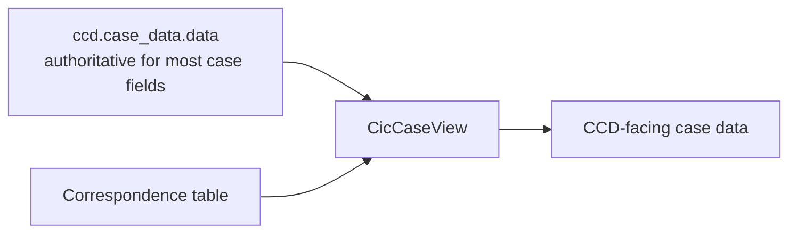
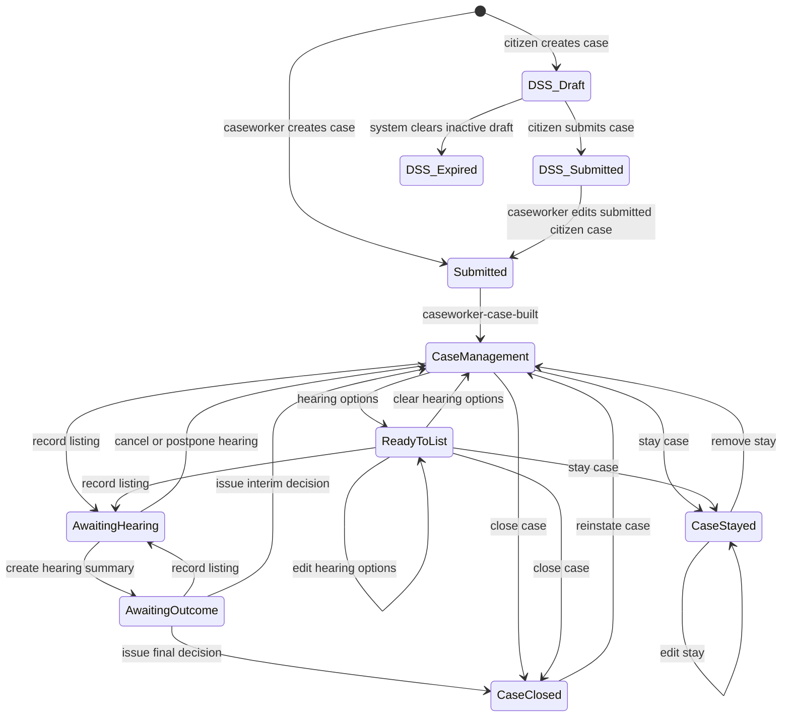

# CCD case states and events in decentralised services

## Purpose and scope

This document is a working mental model of CCD case states and events, derived
from two decentralised CCD services and the CCD SDK implementation:

- `pcs-api` at `93c25a3285c1dbc09130a2189be9641778c3b7c4`
- `sptribs-case-api` at `048a358428d88f01911da7af8988346726d8f4c3`
- `dtsse-ccd-config-generator` at
  `93e6d13e40c47706f139cf50899dc7d124d2c15c`

The generator repository defines the SDK mechanics. PCS and SP Tribunals show
how those mechanics are applied using SDK versions `6.13.0` and `6.8.1`
respectively. The commit hashes matter because event definitions and runtime
capabilities are executable contracts that continue to evolve. They are not
equally suitable design precedents: PCS is closer to a native decentralised
service, whereas SP Tribunals carries forward the legacy CCD JSON/callback
model through the decentralised runtime's compatibility support.

The aim is to provide enough shared vocabulary and implementation detail to
design a state and event model for TEC later. This document deliberately does
**not** propose that model. In particular, the tentative diagrams in
`model.md` are not treated as facts about either reference service.

TEC is assumed to be a new service using the latest SDK with no legacy CCD
storage model to preserve. The approved decentralised CCD low-level design is
therefore normative for the recommendation in this document: the
`ccd.case_data.data` column is always an empty JSON object (`{}`). Business
data is stored in service-owned tables and projected for CCD by `CaseView`.
Older SDK compatibility behaviour is documented only to explain the reference
services, not as an alternative for TEC.

## The model in one paragraph

A CCD case presented to a user is a current state and a current rendered data
projection, plus a normally append-only history of events. An event is an
authorised command that is available only in declared source states. CCD Data
Store authorises and orchestrates the event; the service handler validates
business preconditions, changes service-owned domain data and may choose a
target state. A successful submission atomically updates the local CCD
envelope, renders `CaseView` and appends an event audit record. In a new
decentralised service those CCD records live in the service's database, but
`ccd.case_data.data` remains `{}`. The service's own tables hold the business
truth and `CaseView` turns that truth into the JSON shape CCD exposes.

## Five things that should not be conflated

| Concern | What it represents | Where it is defined or stored |
|---|---|---|
| Case definition | Valid states, events, fields, pages, callbacks and access | Java CCD configuration, imported into Definition Store |
| Current lifecycle position | The one coarse-grained state CCD uses for work routing and event availability | `ccd.case_data.state` |
| Authoritative business data | The service's current domain truth | Service-owned tables |
| Current CCD projection | The latest case-facing JSON matching the imported definition | Rendered on demand by `CaseView` |
| Event history | Normally append-only evidence of what completed, by whom and when, with the resulting state and rendered CCD projection | `ccd.case_event` |

The state is not the history, and a business status field inside case data is
not automatically the CCD state. Similarly, the case event history is an audit
log, not a complete event-sourced domain model from which either reference
service rebuilds all current business data.

For every successful event, the runtime loads `CaseView` after the handler and
stores that rendered CCD projection in `ccd.case_event.data`. The event data is
therefore the CCD-facing view at that event revision, while the current
`ccd.case_data.data` value remains `{}`. The projection can include fields
derived from several service-owned tables, but it is not the private domain
model and should not be used to reconstruct that model.

“Normally append-only” describes the submission API, not an absolute database
constraint. The schema permits controlled updates to historical event data and
audits them in `ccd.case_event_audit`; migrations and repairs can therefore
change a snapshot without erasing evidence of the change.

## What “decentralised CCD” means

Both services apply the HMCTS CCD SDK Gradle plugin and set:

```groovy
ccd {
  decentralised = true
}
```

The generated definition tells CCD how the case type behaves. A separate
environment mapping on **CCD Data Store**, named
`CCD_DECENTRALISED_CASE-TYPE-SERVICE-URLS_<CaseType>`, tells Data Store that
the case type is decentralised and where its persistence service lives. CCD
Data Store remains the front door used by ExUI and API clients, but delegates
case reads, writes and history operations for a matched case type.

```mermaid
flowchart LR
    actor[Caseworker, citizen<br/>or system client]
    dataStore[CCD Data Store]
    definition[Imported CCD definition<br/>states, events, access, pages]
    controller[Case-type persistence API<br/>provided by SDK runtime]
    handler[Service event handler]
    ccdDb[(Local ccd schema<br/>case_data.data = {}<br/>+ case_event projections)]
    domain[(Service domain tables)]
    work[Outbox, scheduler<br/>and external services]
    view[CaseView projection]

    actor --> dataStore
    dataStore --> definition
    dataStore --> controller
    controller --> handler
    handler --> domain
    controller --> ccdDb
    handler --> work
    controller --> view
    ccdDb --> view
    domain --> view
    view --> dataStore
```

This has several consequences:

- The service database contains the SDK-managed `ccd` schema as well as any
  application tables.
- The SDK runtime owns the standard case envelope, versioning, event audit,
  idempotency records and persistence endpoints.
- `ccd.case_data.data` is an empty persistence placeholder, not a location for
  application data.
- Service code still owns the business meaning of every event and state.
- The generated CCD definition is a contract between ExUI/Data Store and the
  service. Event IDs, state IDs and field IDs are persisted identifiers.
- Decentralisation is not permission to update `ccd.case_data.state` directly.
  State changes should still happen by completing CCD events.

Every decentralised case type must resolve to exactly one `CaseView`. The
runtime normally matches a view to configuration by its case-data and state
generic types; `caseTypeIds()` can disambiguate shared Java types. Missing,
unknown or duplicate bindings fail fast at application startup. The view
receives the case reference and typed current state, then loads the required
business data from service-owned repositories. The SDK also exposes a
two-argument overload that supplies a deserialised blob; that exists for
legacy compatibility and is not the pattern for a new service.

The current SDK schema includes current case data, case-event history and
history-change audit, idempotency, significant history items, search/indexing
work, optional Service Bus messages and task outboxes. A
`submitted_callback_queue` existed in the first migration but is removed by a
later migration; current legacy submitted callbacks are invoked synchronously
after the transaction rather than from that historical queue. Exact auxiliary
tables vary by SDK version and enabled features.

### Definition generation and enforcement are different layers

The Java builder compiles configuration into Definition Store JSON. Its main
state/event mappings are:

| Builder call | Generated source and target |
|---|---|
| `.initialState(S)` | No pre-state; post-state `S` |
| `.forState(S)` | Pre-state and post-state `S` |
| `.forStateTransition(A, B)` | Pre-state `A`; fixed post-state `B` |
| `.forStates(A, B, ...)` | Listed pre-states; multiple post-states serialise as `*` |
| `.forAllStates()` | Pre-state `*`; post-state `*` |

If a final handler returns a state, the decentralised runtime persists that
state. If it does not, the incoming state is retained. A fixed transition is
still preferable where the target is known because it makes the imported
definition, UI and audit intent more precise.

The generator also derives access JSON:

- event grants become `AuthorisationCaseEvent`;
- fields used by event pages inherit the event grants unless explicitly
  overridden, with additional access coming from field annotations, tabs and
  search configuration;
- state access is inferred from event grants and combined with explicit state
  access;
- a history-only grant gives read access to the event history but is excluded
  from inferred state access.

The resulting event, state and field permissions remain separate CCD gates,
but their generated values are not independent. A change to an event grant can
change state and field authorisation output as well.

At request time, CCD Data Store enforces the imported event definition,
including role and source-state eligibility, before delegating the final
persistence operation. The service runtime:

- requires an authorisation header and resolves the IDAM actor;
- verifies that the case type and event ID exist in its resolved registry;
- does **not** independently re-run CCD's role grants or pre-state rules;
- applies handler business validation, state/security/metadata results,
  locking, idempotency and persistence.

The persistence endpoint is therefore a trusted internal boundary, not a
second public authorisation layer. Handler validation must still protect
domain invariants that cannot be expressed by the CCD definition.

### The local transaction boundary

For a decentralised event submission the SDK opens a database transaction,
acquires a row lock for an existing case, checks idempotency, invokes the
service handler, upserts the current envelope while keeping its data `{}`,
renders `CaseView`, writes the audit event and records enabled indexing/message
work. Application repository writes made by the handler can participate in the
same transaction when they use the same data source and transaction manager. A
projection or audit failure therefore also rolls back those local domain
writes.

That boundary does not make remote calls transactional. A call to payment,
document generation, notification, role assignment or another service can
succeed or fail independently. Both references therefore contain patterns for
durable follow-up work rather than relying on an in-memory “do this later”.

For legacy about-to-submit callbacks, the runtime also mirrors CCD's document
attachment invariant. A document newly introduced by the callback is attached
through CDAM before case data commits, provided the callback returns the
`document_hash`. Documents already present in event input are not reattached.
The service must provide an `AuthTokenGenerator` whose S2S identity has CDAM
`ATTACH` permission.

### Version, revision and concurrency

The SDK maintains two related counters:

- `case_data.version` is the optimistic-lock version exposed through CCD. It
  advances when the state, resolved TTL or security classification changes. The
  runtime can also version stored-blob changes for compatibility, but a new
  service keeps that blob `{}`.
- `case_data.case_revision` advances for every committed, non-idempotent case
  event and is copied to `case_event.case_revision`. It orders event
  projections and provides the external Elasticsearch version.

All events for an existing case take the same case-row lock, so handlers and
history writes are serialised into a coherent order. After waiting for the
lock, an event that presents a stale `version` and needs to change the
versioned envelope receives `409 CONFLICT`.

This still permits a deliberate concurrency pattern. An event can insert or
merge data in service-owned tables, leave the envelope metadata unchanged and
therefore leave `version` unchanged. Two such submissions can wait for the
same case-row lock and both succeed in order, while each receives a new
`case_revision`. TEC should decide event by event whether it needs:

- optimistic conflict against the CCD envelope;
- insert/merge semantics in service-owned tables; or
- an application-specific lock/version on a normalised aggregate.

The SDK does not add concurrency control to service-owned tables automatically.

### Projection, history and indexing are coupled

After `CaseView` returns, the runtime can populate Global Search
`SearchCriteria` from the imported definition. That serialised projection is
then:

1. returned as the resulting case;
2. stored in `case_event.data` at the new case revision;
3. used by the asynchronous indexer via the event revision.

The indexer does not call today's `CaseView` later to recreate an old event. It
loads the latest stored event projection at or before the queued revision and
writes it to the case-type and, where configured, global-search indices using
external revision ordering. This makes a successful event-time projection part
of the audit and indexing contract.

A view may inject dynamic Markdown or actor-aware fields on ordinary reads, but
the event-time result is frozen into history and feeds indexing. TEC should
keep audit/search-critical fields deterministic and be deliberate about
user-specific presentation in `CaseView`, otherwise the snapshot may reflect
the submitting actor rather than a universal view.

When the event's generated `Publish` flag is enabled, the same transaction can
also write `message_queue_candidates`. That message's additional-data block is
generated from the submitted case details and imported definition; it should
not be assumed to be byte-for-byte identical to the rendered audit projection.
The later publisher sends a candidate and then marks it published, so delivery
must be treated as at-least-once and consumers should deduplicate by stable
event identity.

### Supplementary data is a separate update path

The persistence API supports atomic `$set` and `$inc` operations on
`case_data.supplementary_data`. Such an update advances the case revision and
queues indexing, but does not create a matching case event. Elasticsearch
therefore uses the latest event projection whose revision is less than or
equal to the queued supplementary-data revision. Supplementary data should be
treated as metadata with a deliberately separate audit model, not as a way to
bypass business events.

## States

### What a state is for

A useful CCD state answers a coarse-grained lifecycle question such as:

- Which stage has this case reached?
- Whose workbasket should contain it?
- Which commands should now be available?
- Which broad access and presentation rules apply?
- Is the case active, suspended or terminal?

The generator uses the enum constant's `toString()` value as the persisted
state ID (normally the enum constant name); its `@CCD` label is presentation.
Renaming a constant—or overriding `toString()`—after cases exist is therefore
a data migration and integration concern, not a cosmetic refactor.

State should not absorb every business detail. The references keep narrower
sub-lifecycles in data or domain entities, for example hearing details,
document status, payment status and task status. Promote such a value to a case
state only when it materially changes routing, action availability, access,
reporting or the meaning of the whole case.

### State access is one gate, not the whole security model

The generated definition records which roles can create, read, update or
delete cases in each state. Those values may be inferred from event grants as
well as declared explicitly on the state. Separate CCD gates still control:

1. whether a role can access the case in the current state;
2. whether that role can run a particular event;
3. whether the role can read or update individual fields;
4. whether it can see that event in history;
5. whether role assignment gives the user access to this particular case.

An event hidden from ExUI with a display condition is still addressable through
CCD APIs. UI hiding is not authorisation: Data Store must enforce source-state
constraints and role grants, while the handler enforces business
preconditions. The delegated service persistence endpoint itself does not
repeat Data Store's definition-based authorisation.

For the proposed TEC batch model, TEC System requires case access in all states
shown and permission to initiate events marked ▶ TEC System, subject to their
source-state restrictions. System permissions are configured separately; 👁
lists human read access only. This convention can be stated once alongside the
diagram rather than repeating system access on every state.

A role named `SYSTEM` has no automatic access. In Java configuration,
`builder.grant(state, permissions, UserRole.SYSTEM)` grants state access, while
an event's `.grant(permissions, UserRole.SYSTEM)` grants event permissions.
The SDK derives some state permissions from event grants, but state access alone
does not authorise an event. Reading event history is also distinct from
initiating the event. For example, system access to every batch state does not
make `startProcessing` legal outside `AWAITING_PROCESSING`.

## Events

### What an event is for

An event is simultaneously:

- a command the actor is allowed to attempt;
- a form or API interaction, possibly spread over several pages;
- a validation and persistence boundary;
- an optional state transition;
- a normally append-only audit fact after it completes;
- a trigger for downstream work.

A configured event normally specifies:

| Property | Purpose |
|---|---|
| ID | Stable technical and audit identifier |
| Name, description and summary | ExUI and history presentation |
| Source state(s) | States in which the command is legal |
| Target state | Fixed in configuration or returned dynamically by the handler |
| Pages and mid-event callbacks | Data capture, branching, enrichment and validation |
| Submit handler/callback | Final validation and business mutation |
| Role grants | Who may create/read/update/delete through the event |
| History-only grants | Who may see the completed event without being able to run it |
| Display condition | Whether ExUI offers it visibly |
| Publication metadata | Whether related Work Allocation or event-bus processing is required |
| Retry policy | Primarily relevant to post-submit callback work |
| TTL increment | Whether the event sets or advances disposal timing |

The ID is stored in `ccd.case_event` and may be used by integrations, scheduled
jobs and operational queries. The references contain historically inconsistent
styles—camel case, kebab case and generic names—which is a reason to choose one
TEC convention before any events are imported.

The submit result can also override the case security classification, event
history summary/description and an optional significant item as well as the
state. Server-derived `EventMetadata` is written to history but deliberately
omitted from the callback response JSON. Significant items are held in
`ccd.case_event_significant_items` and currently support the `DOCUMENT` type.

### Useful event categories

1. **Creation events** have no existing source case and declare an initial
   state. The submit handler may return a different final state.
2. **Lifecycle events** move the whole case to a new stage.
3. **Maintenance events** change data but deliberately preserve the state.
4. **System events** turn an external or scheduled fact into an auditable CCD
   change. They are normally UI-hidden and restricted to a service role.
5. **Administrative or migration events** repair or transform cases without
   pretending the change was a normal user journey.
6. **Test-only events** help environments but should not leak into the
   production business language.

State preservation is legitimate. Notes, flags, links and document metadata
often need an audit record without changing which lifecycle stage owns the
case.

One runtime-owned exception is CCD's `DocumentUpdated` system event. The
resolved registry synthesises it across all states if it is received, so a
decentralised service does not have to declare that event itself.

### How the target state is selected

There are three common shapes:

- A fixed transition is declared with a source and target, for example
  `.forStateTransition(Submitted, CaseManagement)`.
- An event is declared for one or more source states and its final callback
  returns the target state. This is useful when the outcome is genuinely
  conditional.
- The callback returns no new state, so the current state is preserved.

Prefer an explicit fixed transition when it is known in advance. Dynamic state
selection should be a small, testable business decision rather than a generic
escape hatch.

## Event execution

### Journey and commit sequence

```mermaid
sequenceDiagram
    participant A as Actor or system
    participant C as CCD Data Store / ExUI
    participant R as Decentralised runtime
    participant H as Service handler
    participant V as CaseView
    participant D as Local database
    participant W as Durable follow-up work

    A->>C: Start event
    C->>R: Start request
    R->>H: Start handler / about-to-start
    H-->>R: Working data, defaults and lists
    R-->>C: First page
    loop each configured page
        C->>R: Mid-event callback
        R->>H: Validate and enrich working data
        H-->>R: Data or blocking errors
        R-->>C: Next page or errors
    end
    A->>C: Submit
    C->>C: Enforce event token, role and source state
    C->>R: Create event with expected version and idempotency key
    R->>D: Lock case and check idempotency
    R->>H: Submit handler / about-to-submit
    H->>D: Business writes in transaction
    H-->>R: State, security, metadata; legacy data update
    R->>D: Upsert case_data envelope; keep data {}
    R->>V: Render resulting CCD projection
    V->>D: Read service-owned domain tables
    V-->>R: Projected case data
    R->>D: Append case_event and transactional outboxes
    Note over R,D: Transaction commits
    opt legacy submitted callback
        R->>H: Invoke after commit
        H-->>R: Confirmation
    end
    W->>D: Claim durable work after commit
    R-->>C: Event confirmation
```

Start and mid-event data are working data; merely opening or progressing
through a journey does not commit a CCD event. Errors returned by a callback
block progression or submission.

On successful submission the runtime also:

- resolves and records the acting IDAM user;
- verifies that the case type and event ID are registered;
- enforces optimistic versioning;
- applies handler-returned state, security and event metadata;
- handles the operation idempotency key;
- renders and writes the resulting `CaseView` event projection;
- returns the resulting case/event confirmation.

CCD Data Store, rather than this runtime, checks role and source-state
eligibility. An optimistic-lock conflict means the actor started from a stale
version of envelope metadata that this event needs to replace and must reload
rather than silently overwrite it. As described above, deliberately
domain-table-only events can use serialised merge/insert semantics without
advancing that optimistic version.

### Two callback styles coexist

The references exercise two ways of defining events:

| Style | PCS | SP Tribunals |
|---|---|---|
| Configuration | `decentralisedEvent(id, submit[, start])` | Legacy `.event(...)` with callbacks |
| Final mutation | Mandatory decentralised submit handler | `aboutToSubmit` callback |
| Post-commit work | Service-owned scheduling/outbox patterns | Synchronous post-commit `submitted` callback with SDK retries |
| Runtime persistence | Local SDK runtime | The same local SDK runtime via compatibility adapter |

In legacy terminology:

- **about-to-start** supplies defaults and dynamic choices before pages;
- **mid-event** validates or enriches between pages;
- **about-to-submit** performs final validation and returns final data/state;
- **submitted** runs after the case event has committed and returns a
  confirmation.

Decentralisation consolidates the final about-to-submit/persist/submitted
operation at the service. It does not move the whole journey into that
transaction: about-to-start and mid-event remain ordinary CCD callback
round-trips. A native `startHandler` is exposed to CCD through the generated
about-to-start callback URL.

A submitted-callback failure cannot roll back the already committed event.
SP Tribunals explicitly reports notification failure in some confirmations
while leaving the case change intact. Post-commit work therefore needs retry,
idempotency and operational visibility.

In the current compatibility handler, any non-empty submitted retry
configuration means three total attempts; the individual timeout numbers are
not interpreted because this mirrors CCD Data Store behaviour. An exhausted
callback produces an empty confirmation rather than rolling back or re-running
the event transaction. Critical delivery should use a durable service-owned
outbox or scheduler instead of depending solely on the request thread.

### Idempotency has two layers

The runtime's per-case idempotency key prevents the same create-event operation
being committed twice. On a hit it does not run the handler or submitted
callback again; it reconstructs the prior resulting case details from the
matching `case_event` snapshot, preserving that event's `version` and
`case_revision` even if the case has since changed. Post-submit confirmation
content is not recreated on this replay path. Business effects need their own
protection too:

- an external provider may deliver the same fact more than once;
- a submitted callback or queued task may be retried;
- an event may intentionally be legal in both its source and target state;
- a failure can occur after an external effect but before local completion.

Examples include checking whether an issued date is already set and scheduling
named work with `scheduleIfNotExists`. For TEC, every externally or
asynchronously triggered event will need an explicit business idempotency rule
in addition to the CCD operation key.

## Reference 1: PCS—the closer precedent for a new service

PCS uses SDK `6.13.0`, configures events with `decentralisedEvent`, and has a
normalised service-owned domain model. `PcsCaseEntity`, `ClaimEntity`,
`PartyEntity`, document entities and related tables are authoritative for
submitted business data. `PcsCaseEntity` does not contain the CCD lifecycle
state; the SDK-owned case envelope does.

### PCS data and projection pattern

`PCSCaseView.getCase(CaseViewRequest)` ignores the stored CCD blob and builds a
fresh `PCSCase` from the normalised model. A set of focused view components
adds claims, parties, documents, grounds, notes, links, flags, applications,
search data, tabs and derived markdown.



Unsubmitted multi-page answers are stored separately in
`draft.draft_case_data`, keyed by case reference, event, IDAM user and party.
`SavingPageBuilder` wraps mid-event callbacks so progress is patched into the
draft after each successful page. When the claim is finally submitted, the
handler maps it into normalised entities and deletes the draft; “save for
later” preserves both the draft and the current state.

This separation is important:

- CCD state says where the whole case is.
- Normalised entities hold submitted domain truth.
- Draft JSON holds incomplete, actor-scoped journey progress.
- `PCSCase` is the CCD command/view shape, not the persistence aggregate.

Some `PCSCase` fields are marked `@External`. The decentralised runtime filters
those fields when a legacy flow serialises the blob. Native decentralised
submit handlers do not return a replacement blob at all; they mutate
service-owned data and return state/metadata. In PCS the stronger guarantee is
the one-argument `CaseView`: all loaded case data is projected from
service-owned sources rather than treating the blob as authoritative.

The resulting PCS projection—including its derived/external fields—is what the
runtime writes into `case_event.data` and queues for indexing. PCS therefore
demonstrates the important direction of travel: domain data is authoritative
and the CCD view is a projection. For TEC, the approved LLD strengthens this
separation into a strict invariant: the physical current blob is not merely
sparse; `ccd.case_data.data` remains `{}`.

### PCS states

PCS currently declares eleven state IDs:

| State ID | Meaning indicated by the label |
|---|---|
| `AWAITING_SUBMISSION_TO_HMCTS` | A case shell/draft exists but the claim has not been submitted |
| `PENDING_CASE_ISSUED` | Submitted and awaiting the issue/payment outcome |
| `CASE_ISSUED` | The case has been issued |
| `JUDICIAL_REFERRAL` | Judicial referral stage |
| `HEARING_READINESS` | Hearing-readiness stage |
| `PREPARE_FOR_HEARING_CONDUCT_HEARING` | Hearing preparation/conduct stage |
| `DECISION_OUTCOME` | Decision/outcome stage |
| `CASE_PROGRESSION` | Post-decision or general progression stage |
| `ALL_FINAL_ORDERS_ISSUED` | Final orders have been issued |
| `CASE_STAYED` | The case is stayed |
| `BREATHING_SPACE` | Breathing-space stage |

The code defines labels and access for all eleven, but only the creation,
submission and issue path currently has domain-specific automated transitions.
A feature-gated caseworker event provides broad manual movement among the
post-issued workflow states.

### PCS implemented core transition graph



`changeCaseState` can start in `CASE_ISSUED` or any of the eight selectable
targets. Those targets are `JUDICIAL_REFERRAL`,
`HEARING_READINESS`, `PREPARE_FOR_HEARING_CONDUCT_HEARING`,
`DECISION_OUTCOME`, `CASE_PROGRESSION`, `ALL_FINAL_ORDERS_ISSUED`,
`CASE_STAYED` and `BREATHING_SPACE`. It is useful while a service is evolving,
but a long-term model of named business events would produce stronger
validation, clearer audit history and better-defined side effects.

PCS has no configured transition from payment failure to a cancelled state.

### PCS events observed

| Event | Source and result | Notes |
|---|---|---|
| `createPossessionClaim` | New case → `AWAITING_SUBMISSION_TO_HMCTS` | Creates a minimal local case and schedules role assignment; start handler applies fee data |
| `resumePossessionClaim` | Awaiting → awaiting or pending | Save keeps the draft; submit persists the normalised claim, removes the draft and schedules fee work |
| `claimIssuePayment` | Pending → issued; also legal as a safe replay | UI-hidden system event; sets issue data and schedules claim-form/access-code work only when needed |
| `changeCaseState` | Any post-issued workflow state → selected post-issued state | Caseworker-only, dynamic and feature-gated |
| Notes, links, flags and documents | State-preserving in their configured state sets | Maintenance events with their own access restrictions |
| Applications, responses, enforcement and eviction | Mostly state-preserving or currently restricted/feature-gated | Several definitions are visibly provisional or TODO-driven |
| Dashboard/test events | State-preserving/hidden | Operational or environment support rather than lifecycle language |

The event enum also contains `submitDefendantResponse`, but no matching event
configuration exists. An enum value alone is not an available CCD event.

### Turning an external fact into a PCS event

The payment path demonstrates the intended boundary:



The callback does not write the CCD state itself. It authenticates as the
system actor and completes `claimIssuePayment`, giving the change a legal
source state, idempotency rule, target state and audit event.

The payment update and the CCD event request do not form a distributed
transaction. The payment entity is changed in a local transaction, and its
strategy makes the CCD request before that local transaction finishes. The
system event's replay guards are therefore important if one side completes and
the other side fails.

## Reference 2: SP Tribunals—a legacy compatibility reference

SP Tribunals uses SDK `6.8.1`. It sets `decentralised = true` but defines most
events with the SDK's legacy callback builder. The decentralised runtime
adapts those callbacks: about-to-submit runs inside submission processing,
then the new envelope and history record are stored locally, then any submitted
callback runs post-commit.

Its persistence model is useful for understanding how an existing CCD service
can be hosted by the decentralised runtime, but it is not a candidate design
for a new service. In particular, persisting business data in
`ccd.case_data.data` conflicts with the approved decentralised LLD invariant
that this column is always `{}`.

### SP Tribunals data and projection pattern

`CriminalInjuriesCompensationData` extends a large typed `CaseData` object.
Most of this object is persisted as JSON in `ccd.case_data.data` and passed
through the event callbacks.

SP also implements the two-argument
`CicCaseView.getCase(request, blobCase)`. It starts from the stored blob and
enriches it with correspondence held in a normalised application table.
Correspondence and a small number of transient reindex fields are marked
`@External`, so the SDK excludes them from persisted blob JSON.
`CicCaseView` can nevertheless add correspondence to the rendered event
snapshot and normal case response after loading that blob.



This is a legacy-compatible hybrid, much closer to a traditional CCD JSON
aggregate than PCS. It explains how SP Tribunals was adapted without first
replacing its persistence model. Its blob growth, historical fields, JSON
migration/repair work and transient-field risks are consequences that a new
decentralised service avoids by keeping `ccd.case_data.data` empty.

The application also queries local `ccd.case_event` explicitly in
`CaseEventRepository` for migrations, restoration and clean-up. This confirms
that the event history belongs to this decentralised service database.

### SP Tribunals states

The state enum has 21 persisted IDs:

`Completed`, `Rejected`, `Sent`, `Withdrawn`, `AwaitingHearing`,
`AwaitingOutcome`, `CaseClosed`, `Concession`, `CaseManagement`, `CaseStayed`,
`StrikeOut`, `ConsentOrder`, `DeathOfAppellant`, `Draft`, `DSS_Draft`,
`DSS_Expired`, `DSS_Submitted`, `NewCaseReceived`, `ReadyToList`, `Rule27` and
`Submitted`.

That list is larger than the currently implemented main path. Some IDs support
citizen submission, legacy/special outcomes or administrative flows and are
not normal targets in the central caseworker lifecycle. The lesson is to
derive the real graph from configured events and callback results, not from the
state enum alone.

### SP Tribunals implemented core transition graph



Additional observations from the callbacks:

- Editing a listing preserves `AwaitingHearing`. Its about-to-start callback
  temporarily returns working state `CaseManagement`, but the final
  about-to-submit result returns `AwaitingHearing`; only the latter is
  committed.
- Editing a hearing summary preserves `AwaitingOutcome`.
- “Remove stay” is also configured from `ReadyToList` and returns
  `CaseManagement`, even though that source is not itself stayed. It is another
  route represented by the `ReadyToList` → `CaseManagement` arrow above.
- A code comment for interim decision mentions an alternative hearing target,
  but the callback returns `CaseManagement`.

These details show why the final submit handler, not an event name or comment,
is the last word on the committed transition.

### SP Tribunals event families

Beyond the core graph, state-preserving events cover:

- case data, categorisation, issue and referral;
- case notes;
- orders, including create, edit, send and due dates;
- document add, amend, remove and management;
- contact with parties;
- case links and case flags;
- anonymity and security;
- panel composition;
- hearing bundles.

System-update events perform migrations, restoration, clean-up and async
completion. They are generally hidden from normal users, restricted to a
system role and state-preserving unless a business transition is intended.
Bundle stitching and hearing-outcome work use the same principle: a worker
causes a system CCD event rather than bypassing event history.

Some workflow-relevant events call `.publishToCamunda()` for Work Allocation.
Despite the historical method name, the generator maps this to the definition's
`Publish=Y`. When messaging is configured, the runtime uses that flag to write
`message_queue_candidates` in the event transaction. SP also enables
`caseEventServiceBus`, which adds the SDK scheduler/publisher that drains that
outbox to Azure Service Bus. These are integration/publication concerns;
neither setting is what causes the state transition. The configured target or
callback response still does that.

SP contains a `caseStatus` data field used by parts of creation, tests and
notification logic. The actual lifecycle is the `State` in `CaseDetails` and
the SDK envelope. This duplicate is a useful warning: a second writable
“state” field creates ambiguity and drift unless it has a clearly different,
bounded meaning.

## Which approach should a new service take?

For a new service using the latest SDK, the choice is not between the PCS and
SP Tribunals persistence patterns. It should take the native decentralised
approach described by the approved LLD. PCS is the closer implementation
reference; SP Tribunals is evidence of compatibility behaviour for a service
with legacy baggage.

| Dimension | New service on the latest SDK | What PCS demonstrates | What SP Tribunals demonstrates |
|---|---|---|---|
| Event style | Native decentralised submit/start handlers | Native handlers | Legacy callbacks adapted by the runtime |
| Current state | SDK-owned `ccd.case_data.state` | The same ownership | The same ownership |
| Current `data` column | Always `{}` | Case loads can ignore the blob | A legacy blob model that TEC must not copy |
| Business-data authority | Service-owned tables | Normalised service entities | Legacy CCD JSON for most fields |
| Case load | One-argument `CaseView` projects service-owned data | Rebuilds the CCD case from domain/view services | Two-argument view enriches the blob |
| Event audit | Rendered `CaseView` stored in `ccd.case_event` | Rich projected event snapshots | Rich projected event snapshots |
| In-progress journeys | Separate actor/event-scoped draft storage when durability is needed | Dedicated draft JSON | Mostly the legacy working/case-data model |
| External facts | Restricted system events plus durable, idempotent work | Hidden system events and durable tasks | System events, callback retries and an event-message outbox |

This distinction concerns current business-data persistence. SP Tribunals can
still teach useful state/event lessons, but its use of `ccd.case_data.data`
cannot establish a storage precedent for a greenfield decentralised service.

## Implications to carry into the TEC workshop

### 1. Enforce the decentralised source-of-truth rule

TEC should adopt one storage model rather than choose field by field:

- service-owned tables are authoritative for all submitted business data;
- native event handlers mutate those tables;
- `ccd.case_data.data` always remains `{}`;
- the one-argument `CaseView` projects service-owned data into the complete
  CCD-facing model;
- unsubmitted journey progress uses separate actor/event-scoped draft storage
  when it must be durable; and
- every field returned by `CaseView` must be reproducible on every case load
  and suitable for capture in the rendered event snapshot.

This improves relational integrity and domain querying but requires explicit
mapping, projection, transaction and concurrency design. `@External` describes
legacy blob-serialization behaviour; it must not be used to create ambiguous
field ownership in a new service.

### 2. Model lifecycle commands, not a database status menu

For each proposed lifecycle event capture:

| Question | Required answer |
|---|---|
| Business command/fact | What happened, in domain language? |
| Actor/trigger | Which user role, service callback or scheduled worker causes it? |
| Source state(s) | In which lifecycle positions is it legal? |
| Target | Fixed target, conditional targets, or deliberately state-preserving? |
| Preconditions | What must be true beyond the source state? |
| Data mutation | Which authoritative fields/entities change? |
| Audit wording | What should a future reader understand from history? |
| Side effects | Which documents, messages, payments, roles or tasks follow? |
| Transaction boundary | Which changes are local and atomic? |
| Idempotency | What proves the business fact has already been handled? |
| Failure/recovery | What is retried, repaired or exposed operationally? |
| Access/visibility | Who can invoke, see data, see history and discover the event in UI? |

A generic “change state” event should not become the primary lifecycle API.
Named events produce meaningful audit entries and give preconditions, data
changes and side effects a natural home.

### 3. Use a state only when the whole case needs one

For every proposed state ask:

- Does it change ownership or workbasket routing?
- Does it change the legal next commands?
- Does it change broad case access or presentation?
- Is it useful for operational reporting?
- Can the same meaning instead be represented as a payment, document, task or
  sub-process status?
- Is the state stable enough to be a persisted public identifier?

Every non-initial state should have at least one intentional entry event.
Every non-terminal state should have an exit or an explained reason it may
remain indefinitely. Stay, rejection, cancellation, failure and reinstatement
paths need the same precision as the happy path.

### 4. Separate committed facts from in-progress journeys

Opening a form, choosing a dynamic option and completing a page are not case
events. Decide whether incomplete progress may be discarded, lives only in the
browser/CCD journey, or requires durable actor-scoped draft storage like PCS.
Do not let half-completed answers overwrite submitted domain truth.

### 5. Treat system changes as first-class events

Payment results, generated documents, scheduler deadlines and async worker
outcomes should normally complete restricted system events. This preserves:

- source-state validation;
- optimistic concurrency;
- idempotency;
- a semantic audit trail;
- the same downstream publication path as user events.

The event should record the business fact, while long-running external work is
queued or scheduled durably and designed for replay.

### 6. Design access as a matrix

The workshop should produce both:

- a state-transition graph; and
- a state × event × actor matrix.

For each cell distinguish “not shown in ExUI” from “cannot be invoked”.
Include case-role assignment, state access, event CRUD grants, field access and
history access. Give system actors narrowly scoped roles rather than reusing a
powerful caseworker role.

### 7. Include disposal in the lifecycle

The current decentralised retain-and-dispose contract makes retention part of
the state/event model. A participating case type provides:

- terminal state `PendingDisposal`;
- system event `MarkForDisposal` from every state whose policy permits
  disposal;
- self-transition event `ConfirmDisposal` with TTL increment `0`, which is the
  event that sets the resolved disposal TTL;
- a system user able to run both events and read `PendingDisposal`.

The service owns the retention policy and deletion of its local case/domain
data. The SDK task marks candidates through CCD events, confirms the central
case pointer is readable, and only deletes an expired local case after CCD
returns `404`; service cleanup and deletion from the local `ccd` tables share a
transaction. TEC's graph should include these states/events rather than
treating disposal as an invisible database job.

### 8. Test the graph as a contract

The references test handlers by building the real generated event
configuration and then invoking start/submit callbacks. TEC should additionally
check graph-wide invariants:

- all intended events appear in the generated definition;
- every event has the expected source states and grants;
- fixed and conditional targets are exhaustively tested;
- forbidden source states fail;
- state-preserving events really preserve state;
- retries do not duplicate business side effects;
- `ccd.case_data.data` remains exactly `{}` after every event;
- projected views can be rebuilt from authoritative data;
- each event snapshot equals its resulting `CaseView`, including projected
  fields;
- stale envelope replacements conflict, while intentionally domain-table-only
  concurrent events both succeed in a serial history;
- terminal and recovery paths are reachable as designed;
- hidden system events cannot be invoked by ordinary actors through CCD;
- disposal events, permissions, TTL and local cleanup obey the retention
  policy.

## Proposed artefacts for the later workshop

The next design session can use this document to create, in order:

1. a glossary of TEC lifecycle facts and actors;
2. a small set of coarse states, each with entry/exit criteria;
3. a named-event catalogue using the template above;
4. the transition graph;
5. the state/event/actor access matrix;
6. the data-ownership map: domain table, CCD projection or transient draft;
7. a side-effect and idempotency map;
8. graph invariants and event-handler test cases.

Naming conventions can then be chosen consistently. The references demonstrate
the mechanics but should not dictate TEC terminology.

## Source map

The most useful implementation anchors are:

### PCS

- `build.gradle` — SDK version and decentralised configuration
- `src/main/java/uk/gov/hmcts/reform/pcs/ccd/CaseType.java` — case-type definition
- `src/main/java/uk/gov/hmcts/reform/pcs/ccd/domain/State.java`
- `src/main/java/uk/gov/hmcts/reform/pcs/ccd/event/EventId.java`
- `src/main/java/uk/gov/hmcts/reform/pcs/ccd/event/CreatePossessionClaim.java`
- `src/main/java/uk/gov/hmcts/reform/pcs/ccd/event/ResumePossessionClaim.java`
- `src/main/java/uk/gov/hmcts/reform/pcs/feesandpay/event/ClaimIssuePayment.java`
- `src/main/java/uk/gov/hmcts/reform/pcs/ccd/event/changecasestate/ChangeCaseState.java`
- `src/main/java/uk/gov/hmcts/reform/pcs/ccd/PCSCaseView.java`
- `src/main/java/uk/gov/hmcts/reform/pcs/ccd/service/DraftCaseDataService.java`
- `src/main/java/uk/gov/hmcts/reform/pcs/ccd/page/builder/SavingPageBuilder.java`
- payment callback and `CcdPaymentStateUpdateService` classes

### SP Tribunals

- `build.gradle` — SDK version, decentralised and event-bus configuration
- `src/main/java/uk/gov/hmcts/sptribs/ciccase/CriminalInjuriesCompensation.java`
- `src/main/java/uk/gov/hmcts/sptribs/ciccase/model/State.java`
- `src/main/java/uk/gov/hmcts/sptribs/ciccase/model/CaseData.java`
- `src/main/java/uk/gov/hmcts/sptribs/ciccase/CicCaseView.java`
- event classes under `common/event`, `citizen/event`, `caseworker/event` and
  `systemupdate/event`
- `src/main/java/uk/gov/hmcts/sptribs/common/repositories/CaseEventRepository.java`

### CCD SDK runtime

The authoritative implementation source is in
`/Users/chris.bellingham/workspace/hmcts/dtsse-ccd-config-generator`:

- `README.md` and `docs/decentralised-runtime.md`
- `docs/concurrency.md`, `docs/elasticsearch-indexing.md`,
  `docs/routing-configuration.md` and `docs/retain-and-dispose.md`
- `sdk/ccd-config-generator/src/main/java/uk/gov/hmcts/ccd/sdk/EventTypeBuilderImpl.java`
- `sdk/ccd-config-generator/src/main/java/uk/gov/hmcts/ccd/sdk/generator/CaseEventGenerator.java`
- the `AuthorisationCaseEventGenerator`, `AuthorisationCaseStateGenerator` and
  `AuthorisationCaseFieldGenerator` classes in the same generator package
- `sdk/decentralised-runtime/src/main/java/uk/gov/hmcts/ccd/sdk/impl/CaseSubmissionService.java`
- `CaseProjectionService`, `CaseDataRepository`, `AuditEventService`,
  `IdempotencyEnforcer`, `LegacyCallbackSubmissionHandler` and
  `DecentralisedSubmissionHandler` in the same `impl` package
- `sdk/decentralised-runtime/src/main/java/uk/gov/hmcts/ccd/sdk/CaseView.java`
- `sdk/decentralised-runtime/src/main/resources/dataruntime-db/migration`

The `decentralised-runtime` JARs resolved by PCS and SP Tribunals provide the
compatibility baseline where their released SDK versions differ from the
generator source baseline.
