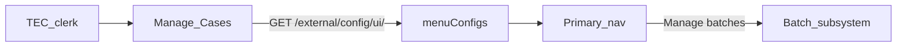

# ExUI “Manage batches” primary navigation

Architect proposal: add a role-gated **Manage batches** item to Manage Cases primary navigation
by changing ExUI `menuConfigs`, with a local custom-image path for the TEC prototype and a later
platform release for shared environments.

## Problem

TEC clerks need a **global** link from Manage Cases to a separate batch subsystem (not
case-scoped). CCD tabs, Tasks HTML, and case events cannot own this. Primary navigation is owned
by **ExUI** (`rpx-xui-webapp`).

## Recommended solution

Add a **Manage batches** item to ExUI’s baked-in menu configuration
(`api/configuration/menuConfigs/`), gated to TEC IdAM roles, pointing at the batch service URL.

### How ExUI nav actually works

- Browser loads `headerConfig` from `/external/config/ui/`.
- Server builds that from `setupMenuConfig(environment)` →
  [base-config.ts](https://github.com/hmcts/rpx-xui-webapp/blob/master/api/configuration/menuConfigs/base-config.ts)
  (+ AAT diffs), **not** from a live `HEADER_CONFIG` env var for the UI payload.
- `HeaderConfigService` picks the first role-regex key that matches the user (else `.+`).
- Individual items can further gate on `roles` / LaunchDarkly `flags`.

The durable change is a **code change (and release) of ExUI menuConfigs**.

Menu shape and JSON fragment for discussion:
[exui-navigation.md](./exui-navigation.md) and
[exui-header-config.example.json](./exui-header-config.example.json).

### Proposed menu shape for TEC

Add a dedicated role key (recommended), rather than appending into `.+` for all services:

| Item | `href` |
| --- | --- |
| Create case | `/cases/case-filter` |
| **Manage batches** | Absolute URL of the batch UI (per env) |
| Find case | `/cases/case-search` (right-aligned, existing pattern) |

Omit **Case list** from the TEC menu; clerks still reach `/cases` via the **Manage cases** title.

- **Role key:** `caseworker-tec` (or `^caseworker-tec` / `^caseworker-tec$` depending on whether
  `caseworker-tec-system` should see it). Local IdAM roles today: `caseworker-tec`,
  `caseworker-tec-system` (`UserRole` in this repo).
- **Label:** `Manage batches`
- **Target:** external HTTPS URL of the batch subsystem (same-tab is fine; ExUI `NavigationItem`
  has no first-class `target`). Prefer absolute URL unless SSO/CSP force a same-origin proxy path
  later.

### What to change in ExUI

1. `api/configuration/menuConfigs/base-config.ts` — add TEC role-key menu including Manage batches.
2. Confirm whether AAT needs anything in `aat-diffs.ts` (usually not for a new key).
3. Do not copy Case list into the TEC key unless product wants it; title/home already opens cases.
4. Release via normal ExUI pipeline; environments pick up the new webapp image.

### Ownership and dependencies

| Concern | Owner |
| --- | --- |
| Nav item + role gating | ExUI (`rpx-xui-webapp`) |
| Batch application + URL | TEC / batch service team |
| IdAM roles for TEC clerks | IdAM / TEC access model |
| This POC repo (`tec-poc`) | Cannot ship primary nav; only documents and local wiring |

### Non-goals

- No CCD / TEC API change for the nav link itself.
- Not a first-class ExUI feature module (unlike Work Allocation “My work”) unless product later
  wants batches inside Manage Cases chrome.
- Not Manage Organisation-style second app unless product splits UX that way.

## Prototype without AAT/prod platform change

This repo simulates the menuConfigs change locally with a reverse proxy (not a custom XUI image):

- `bootWithCCD` sets `XUI_PORT=3002` (real Manage Cases container).
- `bin/start-xui-manage-batches-proxy.sh` publishes **http://localhost:3000** and rewrites
  `/external/config/ui/` to inject a `caseworker-tec` menu that includes **Manage batches**.
- `/tec-manage-batches` is a placeholder page for the batch subsystem.

Details: [exui-navigation.md](./exui-navigation.md).

- `RSE_LIB_XUI_ENV_HEADER_CONFIG` will **not** work — UI ignores it for `headerConfig`.
- Restarting the stock stack alone without the proxy (or with XUI still bound to :3000) will
  **not** show Manage batches.

## Risks / decisions

1. **External URL vs same-origin proxy** — absolute URL is simplest; same-origin only if IdAM
   cookies / CSP block cross-origin.
2. **Who sees the link** — clerks only vs clerks + system role.
3. **Create case visibility** — TEC create is system-driven today; keeping Create case in the TEC
   menu matches ExUI norms but may be unused for clerks.
4. **Cross-jurisdiction pollution** — dedicated `caseworker-tec` key avoids showing Manage batches
   to all `.+` users.
5. **Release coupling** — nav appears only after an ExUI release; batch URL must exist (or be
   behind a flag/placeholder) per environment.

## Acceptance criteria

- TEC clerk signing into Manage Cases sees **Manage batches** in the primary nav.
- Non-TEC users do not see it.
- Link opens the batch subsystem (correct env URL).
- Create case / Find case remain; Case list can stay hidden with cases reachable via Manage cases.
- Local POC can demonstrate the same nav via the Manage batches nav proxy without AAT/prod deploy.

## Follow-ups

- [ ] ExUI PR: add `caseworker-tec` menu key with Manage batches + standard items in `base-config.ts`
- [ ] Agree per-environment batch service URL (and clerk vs system role gating) with product
- [x] Local simulation: nav-injection proxy on :3000 (`bin/start-xui-manage-batches-proxy.sh`)
