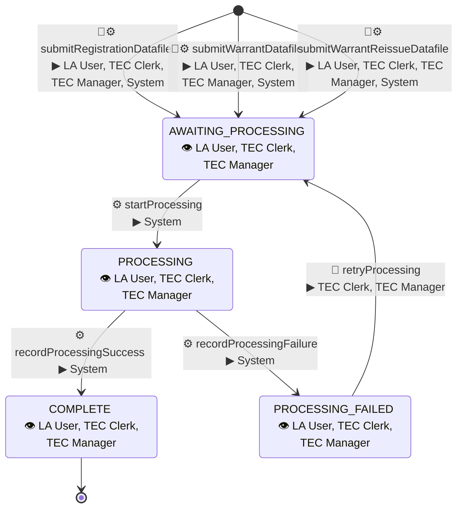

# Initial CCD Config

This document defines the initial CCD config for TEC.

| Actor       | Description                                                    |
|-------------|----------------------------------------------------------------|
| LA User     | Local Authority user                                           |
| LA Manager  | Local Authority user with specific management responsibilities |
| TEC Clerk   | Administrative TEC user                                        |
| TEC Manager | TEC user with additional privileges                            |
| System      | TEC backend service initiating automated events                |

| Symbol | Meaning                                                             | Placement |
|--------|---------------------------------------------------------------------|-----------|
| ⚙     | System-driven event, initiated by a TEC backend service             | Events    |
| 👤     | User-driven event, initiated by a human user, normally through ExUI | Events    |
| ▶      | Roles permitted to initiate the event                               | Events    |
| 👁     | Human roles permitted to view the case                              | States    |

# Case Type: TEC_BATCH_DATAFILE

The `TEC_BATCH_DATAFILE` case type is assumed to cover the following use cases:

* Bulk PCN Registration
* Bulk Warrant
* Bulk Warrant Reissue

## State & Event Model

Each use case has its own creation event and can have different ExUI pages and validation.
Each creation event can be initiated by a user through ExUI or by the TEC system for an automated submission.

| Creation event                 | Submission type  |
|--------------------------------|------------------|
| `submitRegistrationDatafile`   | PCN registration |
| `submitWarrantDatafile`        | Warrant          |
| `submitWarrantReissueDatafile` | Warrant reissue  |

The creation event sets the submission type, which remains fixed for the lifetime of the case.
Validation and processing behaviour depend on the submission type, with required business validation applied to both user and automated submissions.

## ExUI Config

### Search Input Fields

| Field label      |
| ---------------- |
| Jurisdiction     |
| Case type        |
| State            |
| File identifier  |
| Batch identifier |
| Local authority  |
| Submitter email  |
| Batch type       |
| Received via     |

### Search Result Fields

| Field Label             |
|-------------------------|
| Case Number             |
| State                   |
| File identifier         |
| Local authority         |
| Batch type              |
| Number of PCNs in batch |
| Submitter email         |
| Received via            |
| Received at             |

### Tab: Datafile Details

| Field Label              |
| ------------------------ |
| Status                   |
| File identifier          |
| Batch identifier         |
| Local authority          |
| Submitter email          |
| Batch type               |
| Number of batches        |
| Number of PCNs           |
| Number of PCNs processed |
| Fees due                 |
| Received via             |
| Email received at        |
