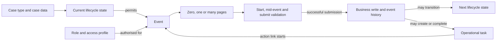
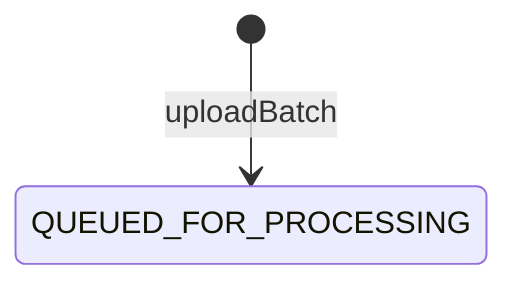
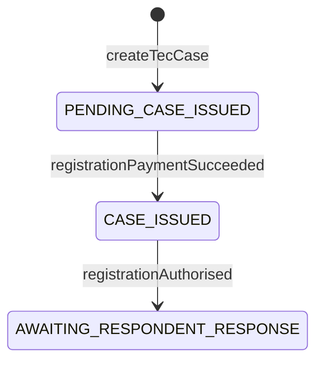

# Defining a state, event and task model for multi-page CCD journeys

## Purpose

This document describes how to define an initial state, event and task model for a service that uses CCD and ExUI. It
first describes the approach generically and then applies it to the Traffic Enforcement Centre (TEC), using this proof
of concept as a starting point for the first production implementation.

The model should be agreed as a business lifecycle before it is encoded in CCD configuration. CCD pages are a
presentation of an event; they are not the lifecycle model themselves. Likewise, an operational task may lead a user
to an event, but a task is not a page or an event.

The TEC-specific section distinguishes between:

- behaviour demonstrated by the POC;
- a reasonable initial production baseline; and
- decisions that still require agreement with product, operations and platform teams.

## The generic model

### The relationship between cases, states, events, journeys and tasks



Each concept has a separate purpose:

| Concept | Meaning | Examples |
| --- | --- | --- |
| Case type | The aggregate whose lifecycle CCD manages | A PCN, uploaded batch or exception item |
| Case data | Business facts associated with that case | PCN, local authority, uploaded document |
| State | A durable, externally meaningful lifecycle phase | Queued for processing, processing complete |
| Event | An authorised command or fact recorded in case history | Upload batch, validate form, payment succeeded |
| Journey page | One interaction step used to collect or present event data | Select type, upload document, statement of truth |
| Callback | Server-side preparation, validation or submission behaviour | Populate choices, validate a document, persist data |
| Task | A unit of operational work assigned to a user or team | Validate application form, resolve exception |
| Role | Who may see a case, start an event or work a task | Clerk, local authority user, system integration |

### State model

A CCD state should represent a meaningful phase of the case lifecycle. It should normally be visible in reporting,
search, event eligibility or operational routing.

Good states:

- describe an outcome or a stable waiting condition;
- remain true after the browser journey has finished;
- affect which events, tasks or permissions apply; and
- are few enough that the lifecycle can be understood as a state diagram.

Avoid creating states for:

- individual pages such as `UPLOAD_FILE` or `STATEMENT_OF_TRUTH`;
- temporary validation errors;
- UI navigation;
- the assignment status of a task; or
- every field value or technical processing step.

For each proposed state, record:

| Attribute | Question |
| --- | --- |
| ID | What stable machine-readable identifier will integrations and tests use? |
| Label | What should a user see? |
| Meaning | What business facts are true while the case is in this state? |
| Entry events | Which successful events can enter it? |
| Exit events | Which events can leave it? |
| Permitted roles | Who may read or update the case in it? |
| Active tasks | What human work can exist in it, and under what additional conditions? |
| Terminal? | Is further lifecycle progression expected? |

State IDs and event IDs should be treated as contracts. They appear in CCD definitions, URLs, event histories,
integration requests, task configuration, tests and operational reporting. Renaming them after go-live is a migration,
not merely a refactor.

### Event model

An event represents something that a user or system is allowed to do to a case. It may change case data, change state,
create or complete tasks, attach documents and record an audit entry.

Events generally fall into four categories:

| Category | Purpose | Typical visibility |
| --- | --- | --- |
| Initial event | Creates a new case and assigns its initial state | User journey or system API |
| User command | Captures a decision or amendment | ExUI Next step or task action |
| System fact | Records the outcome of automated processing | Hidden from ExUI; integration-only |
| Administrative event | Repairs or supplements data without advancing the lifecycle | Restricted and usually hidden |

Define every event in an event catalogue before implementing it:

| Attribute | Description |
| --- | --- |
| ID and label | Stable ID and user-facing name |
| Trigger | User, task, integration, scheduled process or primary navigation |
| Source states | States from which the event is legal |
| Target state | Resulting state, or explicitly unchanged |
| Authorised roles | Roles granted read/create/update permissions for this event |
| Input | Fields and documents accepted by the event |
| Preconditions | Conditions that must already be true |
| Validation | Page-level and final business rules |
| Side effects | Business persistence, document storage, notifications and downstream messages |
| Task effects | Tasks created, completed, cancelled or left unchanged |
| Failure behaviour | Whether the user remains on a page, the transaction rolls back, or retry is expected |
| Audit content | Event name, description and any event metadata required in history |

An event does not need pages. Integration-only events commonly accept data through CCD APIs and remain hidden from
the ExUI Next step list. Conversely, a user event can contain a long multi-page journey while still producing one
submitted event and, usually, one state transition.

### Multi-page event journeys

CCD and ExUI natively support multi-page event journeys. The CCD Java SDK provides a fluent configuration that is
compiled into `CaseEvent` and `CaseEventToFields` definition records. ExUI groups fields by `PageID`, orders the pages
and fields, renders standard CCD controls, and carries the in-progress event data between pages.

A generic decentralised event looks like this:

```java
builder.decentralisedEvent("submitRequest", this::submit, this::start)
    .forStateTransition(State.DRAFT, State.SUBMITTED)
    .name("Submit request")
    .grant(Permission.CRU, UserRole.CASEWORKER)
    .showSummary()
    .endButtonLabel("Submit")
    .fields()
    .page("chooseRequestType")
    .pageLabel("Choose request type")
    .mandatory(CaseData::getRequestType)
    .page("uploadDocuments", this::validateDocuments)
    .pageLabel("Upload documents")
    .mandatory(CaseData::getDocuments)
    .page("statementOfTruth")
    .pageLabel("Statement of truth")
    .label("statementOfTruthWarning", STATEMENT_OF_TRUTH_WARNING)
    .mandatory(CaseData::getStatementOfTruth);
```

The important elements are:

| SDK configuration | Effect |
| --- | --- |
| `.page("id")` | Starts a page and gives it a stable ID |
| `.pageLabel("label")` | Supplies the page heading shown by ExUI |
| `.mandatory(...)` | Adds a required event field |
| `.optional(...)` | Adds a non-required event field |
| `.readonly(...)` / `.label(...)` | Adds calculated or explanatory content |
| `.showCondition(...)` | Shows a page or field only when a CCD expression is true |
| `.page("id", callback)` | Adds a mid-event callback for validation or enrichment |
| `.showSummary()` | Enables ExUI's standard Check your answers page |
| `.endButtonLabel(...)` | Sets the final action label |

The field's CCD type determines its standard ExUI component. For example, a `Document` produces an upload control, a
`FixedRadioList` produces radio buttons, and a single-option `MultiSelectList` can be used for an agreement checkbox.
Labels can supply markdown or supported HTML, but they should not be used to recreate controls that CCD already
provides.

Page IDs are also contracts. They are used in generated definitions, callbacks, functional tests and telemetry. A
page label may change as content evolves; a page ID should remain stable unless there is a deliberate migration.

#### Callbacks and transaction boundaries

A typical journey has up to four server-side stages:

1. The start handler prepares dynamic choices and view data before the first page.
2. A mid-event callback validates or enriches data as the user moves beyond a particular page.
3. The submit handler applies final validation, writes business data and returns the resulting state.
4. The submitted response supplies confirmation content and may initiate post-commit behaviour, depending on the
   chosen CCD integration model.

Mid-event validation improves the user experience but must not be the only enforcement of a business invariant. A
client can submit through an API, data may be changed after an earlier page, and retries can occur. Required
invariants must therefore also be enforced at submission and, where appropriate, by the domain or persistence layer.

For a decentralised case type, the submitted event is dispatched to the handler registered by
`decentralisedEvent(...)`. The generated CCD JSON contains metadata and callback URLs; it does not contain the Java
handler. Business writes and the decentralised CCD lifecycle update should share the intended transaction boundary.

#### Conditional journeys

Conditional pages and fields should be derived from explicit case or event data. A useful model records each branch:

| Page ID | Heading | Fields/content | Display condition | Callback | Included on summary? |
| --- | --- | --- | --- | --- | --- |
| `chooseRequestType` | Choose request type | Request type | Always | None | Yes |
| `uploadDocuments` | Upload documents | Documents | Type requires evidence | Validate files | Yes |
| `statementOfTruth` | Statement of truth | Warning and agreement | Always | None | Agreement only |

Avoid encoding core business rules solely in presentation conditions. The same rule should have a named server-side
representation that can be tested without ExUI.

### Task model

CCD event pages and Work Allocation tasks are separate platform concepts. Defining a page or state does not create a
task. Production tasks require an agreed Work Allocation/orchestration design and the corresponding task configuration
or process implementation.

A task represents human work, not simply that a case happens to be in a state. Define tasks with the following model:

| Attribute | Description |
| --- | --- |
| Type and name | Stable task type plus a concise operational label |
| Activation | Event or business condition that creates the task |
| Eligibility | Roles or organisational attributes allowed to claim it |
| Assignment | Initial assignee, team, region or unassigned queue |
| Priority and due date | Explicit calculation from business dates and service levels |
| Action event | CCD event normally opened by Go to task |
| Completion | Submitted event/outcome that completes the task |
| Cancellation | Events or state changes that make it obsolete |
| Dependencies | Tasks or facts that must exist before activation |
| Idempotency | How retries avoid duplicate active tasks |

The relationship should be explicit. For example:

| Task | Activation | Action event | Completion | Cancellation |
| --- | --- | --- | --- | --- |
| Validate application form | Application recorded and validation absent | `validateApplication` | Validation successfully recorded | Application withdrawn or case closed |

Do not automatically create a human task for every state. Waiting for an automated processor or an external party is
usually a state or monitoring concern, not operational work. Create a task only when a person has a clear outcome to
deliver.

### Roles and access

Access must be defined independently at several layers:

- case-type access;
- state access;
- event access;
- field access;
- case-level access or access categories; and
- task eligibility and assignment.

An event hidden from ExUI is not secured merely because it is hidden. System events must have appropriately restricted
event permissions and authenticated callers. Similarly, permission to update a case does not automatically mean a user
should be eligible for every task associated with it.

### Source structure

For a small journey, pages may be declared inline with the event. As the model grows, a useful structure is:

```text
ccd/
  domain/                 case data, fixed lists and state enum
  event/                  event configuration and submit/start handlers
  page/                   one page configuration per cohesive interaction step
  task/                   task types and task lifecycle mapping
  access/                 roles and access rules
  service/                domain operations and orchestration
```

Page classes should describe presentation and collect input. Business operations belong in services or event handlers.
This page-composition approach is used extensively by `pcs-api` and `sptribs-case-api`; it is an organisational wrapper
over the native SDK rather than an alternative UI framework.

### Definition and verification workflow

For each change to the model:

1. Update the state diagram, event catalogue, page table and task catalogue together.
2. Implement the model in the CCD SDK configuration and domain types.
3. Generate the CCD definitions.
4. Inspect the generated `CaseEvent`, `CaseEventToFields`, state and authorisation records.
5. Import a clean definition into the target environment.
6. Test allowed and forbidden state transitions through CCD APIs.
7. Test the complete ExUI journey, including Back, conditional branches, validation and Check your answers.
8. Test task creation, assignment, completion, cancellation and retry behaviour independently of page rendering.
9. Verify case history, audit metadata, business persistence and document categorisation.

Generated definition files are build output, not the authoritative model. The Java configuration and the agreed model
documentation are the sources of truth.

## Applying the model to TEC

### Case boundaries demonstrated by the POC

The POC defines three case types under the `TEC` jurisdiction:

| Case type | Aggregate | Current purpose |
| --- | --- | --- |
| `TEC` | One PCN case | Registration and subsequent PCN/application lifecycle |
| `TEC_BATCH` | One submitted batch | Upload, validation, processing and batch outputs |
| `TEC_EXCEPTION` | One exception item | Clerk investigation and correction of an item that cannot progress normally |

This is a sensible initial separation because each aggregate has a different lifecycle, access pattern and operational
unit of work. Production discovery should nevertheless confirm identity, ownership and retention rules, particularly
whether every invalid batch row becomes an exception case and how it links back to its batch and PCN.

### TEC batch state model

The current POC deliberately implements only the entry point to the batch lifecycle:



| State | Meaning in the POC | Production question |
| --- | --- | --- |
| `QUEUED_FOR_PROCESSING` | The batch case and its source-document reference exist and await processing | What event and outcome should begin processing? |

Processing, completion, failure and intervention states are intentionally outside this slice. Before production,
consider them only when they change user expectations, permitted recovery events, reporting or operational work.

### TEC batch event catalogue

The current POC baseline is intentionally limited to one user-facing creation event:

| Event | Trigger | Source to target | Visibility | Main effect |
| --- | --- | --- | --- | --- |
| `uploadDatafile` | Clerk from primary navigation | New case to `QUEUED_FOR_PROCESSING` | User-facing | Collects a CCD document, runs placeholder validation and persists its CDAM reference metadata |

There is no API-only creation channel or processing event in this slice.

### TEC Upload batch file journey

The POC declares `uploadDatafile` as one initial CCD event containing two configured pages, followed by native summary
and confirmation screens:

| Order | Page ID | Heading | Purpose | Current status |
| --- | --- | --- | --- | --- |
| 1 | `uploadFile` | Upload batch file | Collect the CCD `Document`; invoke a mid-event callback | Validation always passes |
| 2 | `validationResults` | File validation complete | Confirm that the file is ready to submit | Static success content |
| 3 | ExUI summary | Check your answers | Review the uploaded file | Native `.showSummary()` behaviour |
| 4 | Submitted response | Batch file uploaded | Confirm that the batch is queued | Implemented |

The source configuration is
[`BatchDatafileCaseConfiguration`](src/main/java/uk/gov/hmcts/reform/tecpoc/ccd/batchdatafile/CaseConfiguration.java). Field types
are declared on [`BatchDatafileCase`](src/main/java/uk/gov/hmcts/reform/tecpoc/ccd/batchdatafile/Case.java), while the service-owned
document reference metadata is persisted separately from the CDAM binary.

For the first production cut, the journey needs the following rules made explicit:

- accepted file types, maximum size, malware-scanning expectations and document category;
- the schema and version for each batch type;
- whether structural validation is synchronous enough for a mid-event callback;
- whether row-level validation is synchronous or belongs to later batch processing;
- whether a user may submit a partially valid batch and how excluded rows are represented;
- whether resubmission creates a new batch or replaces an existing one;
- statement-of-truth wording, who may make it, and the audit data retained;
- local-authority ownership and case-access category derivation;
- duplicate submission/idempotency behaviour;
- confirmation content and the point at which the batch becomes legally or operationally accepted; and
- failure and retry behaviour if document attachment or business persistence fails.

The current submit handler performs a valuable defence-in-depth check that the statement of truth was accepted. The
same pattern should be retained: the field is mandatory in the page definition, and the invariant is checked again by
the submitted event handler.

### TEC PCN state and event baseline

The POC currently models the main PCN progression as:



`CLOSED` exists in the state enum but no POC event enters it. That is a useful signal that the lifecycle is incomplete,
not a reason to infer the missing transition. Production modelling must define closure reasons, who or what closes a
case, whether closure is reversible, and which outstanding tasks are cancelled.

The events already demonstrate three distinct kinds of action:

- system lifecycle events: `createTecCase`, `registrationPaymentSucceeded`, `registrationAuthorised`;
- integration/administrative updates: `recordApplication`, `recordTimeExtension`, `attachCaseFileDocument`; and
- clerk actions: `verifyFormValidation` plus form-specific TE9, PE3, TE7 and PE2 edit events.

This division is a useful baseline, but the first production event catalogue should resolve gaps such as payment
failure, duplicate registrations, rejected authorisation, respondent outcomes, closure and correction/audit policy.

### TEC exception state and event baseline

The POC gives exception cases one state, `OPEN`, with clerk-visible `rejectItem` and `editPcn` events. Neither event
changes state. This supports UI exploration but does not yet describe a complete exception lifecycle.

A production model will probably need to distinguish at least the business outcomes of resolving, rejecting and
possibly reprocessing an exception. The names and exact number of states should follow the operational process rather
than be assumed from the POC. Required decisions include:

- what creates an exception and how it links to its source batch and row;
- what “reject” means and whether it is terminal;
- whether correcting an item automatically resubmits it for processing;
- what event records successful resolution;
- which tasks complete or cancel for each outcome; and
- what a local authority is allowed to see.

### TEC task model

The POC's Tasks tabs are deliberately HTML approximations of ExUI Work Allocation cards. They are populated by
`TecPrototypeTasks`, `BatchPrototypeTasks` and `ExceptionPrototypeTasks`; they are not connected to Work Allocation,
Camunda or task APIs. Their hard-coded users, relative dates, priorities and assignment actions must not be carried into
production as implementation.

They are still useful as a catalogue of candidate operational work:

| Candidate task | Case type | Candidate activation | Candidate action event | Comment |
| --- | --- | --- | --- | --- |
| Validate application form | `TEC` | Application present and validation result absent | `verifyFormValidation` | Strong candidate; activation and completion can be stated objectively |
| Correct application data | `TEC` | Validation identifies correctable OCR data | Form-specific edit event | Decide whether one generic correction event is preferable |
| Review issued case | `TEC` | Currently based mainly on state | Not yet defined | Too broad until a concrete outcome and completion event are agreed |
| Complete registration checks | `TEC` | Case issued and checks outstanding | Several possible events | Should be decomposed or given one clear completion outcome |
| Chase payment confirmation | `TEC` | Payment has exceeded an agreed service level | Not yet defined | Requires a real due-date source and escalation outcome |
| Review queued batch | `TEC_BATCH` | Batch submitted | Not yet defined | Do not create if normal processing is fully automated |
| Monitor batch processing | `TEC_BATCH` | Processing started | Not yet defined | Usually monitoring rather than a human task; use only for an actionable exception |
| Review batch outputs | `TEC_BATCH` | Processing completed with reviewable output | Not yet defined | Define what acknowledgement or decision completes it |
| Review exception item | `TEC_EXCEPTION` | Exception created | `editPcn` or `rejectItem` | Strong candidate once terminal outcomes are modelled |

An intentionally small first production task model would be preferable to reproducing every POC card. A defensible
starting set is:

1. **Validate application form**, when an application requires human validation.
2. **Resolve exception item**, when automated processing creates an actionable exception.
3. **Review failed or partially processed batch**, only when automation cannot progress without a human decision.

Each must be completed or cancelled by a named event/outcome. Normal automated batch progression should not create a
human task.

### Initial TEC traceability matrix

The production model should maintain a matrix like this as it develops:

| Case type/state | Event | Journey | Task effect | Role |
| --- | --- | --- | --- | --- |
| New `TEC_BATCH_DATAFILE` | `uploadDatafile` | Upload → validation result → summary | No task | Clerk |
| PCN with unvalidated application | `verifyFormValidation` | Validation decision page(s) | Complete Validate application form | Clerk |
| Open exception | correction event to be agreed | Correction journey | Complete or retain Resolve exception item based on result | Clerk |
| Open exception | rejection event to be agreed | Reason and confirmation | Complete Resolve exception item | Clerk |

This makes omissions visible. An event with no authorised trigger, a task with no completion event, or a state with no
legal exit can be challenged before implementation.

### Recommended first-cut implementation shape

Use the POC's decentralised CCD boundary, typed case data and generated definitions, but separate the growing model by
responsibility:

- one state enum per case type;
- one event configuration/handler per significant event;
- one page configuration class per non-trivial page;
- shared, testable domain validation outside presentation callbacks;
- an explicit event-to-task lifecycle mapping;
- role and case-access-category rules alongside, but separate from, journey layout; and
- model-level tests that assert transitions, permissions, page order and task effects.

Keep event/page IDs as constants where they are referenced by task configuration, links or tests. Keep display copy
separate enough that content changes do not obscure lifecycle changes.

### Decisions required before treating the POC model as production-ready

The following should be resolved in a short state/event/task modelling exercise:

1. Confirm the aggregate boundaries and identifiers for PCNs, batches and exception items.
2. Agree the happy-path and failure state diagrams for each case type.
3. Give every state a precise entry condition and every non-terminal state at least one intended exit.
4. Catalogue user, integration and administrative events with permissions and idempotency rules.
5. Define the synchronous and asynchronous validation boundary for batch uploads.
6. Define only actionable human tasks, each with activation, completion and cancellation events.
7. Agree local-authority visibility, case access and task eligibility.
8. Identify notifications, documents and downstream messages emitted by each submitted outcome.
9. Decide which identifiers and payloads are external contracts and version them accordingly.
10. Convert unresolved POC placeholders into named product decisions, not implicit implementation behaviour.

## Existing precedent

This modelling and implementation style is established in nearby HMCTS services:

- PCS's [MakeAnApplication](../../../pcs-api/src/main/java/uk/gov/hmcts/reform/pcs/ccd/event/genapp/MakeAnApplication.java)
  composes a long decentralised CCD event from page classes and enables the native summary page.
- PCS's [make-an-application StatementOfTruth](../../../pcs-api/src/main/java/uk/gov/hmcts/reform/pcs/ccd/page/makeanapplication/StatementOfTruth.java)
  defines the warning and mandatory agreement fields as a normal CCD page.
- PCS's [WarrantPageConfigurer](../../../pcs-api/src/main/java/uk/gov/hmcts/reform/pcs/ccd/page/enforcetheorder/warrant/WarrantPageConfigurer.java)
  assembles a substantial conditional journey ending in a statement of truth.
- Special Tribunals' [CaseworkerHearingOptions](../../../sptribs-case-api/src/main/java/uk/gov/hmcts/sptribs/caseworker/event/CaseworkerHearingOptions.java)
  demonstrates multiple pages, a mid-event callback and a native summary page.
- Special Tribunals' [CaseworkerCloseTheCase](../../../sptribs-case-api/src/main/java/uk/gov/hmcts/sptribs/caseworker/event/CaseworkerCloseTheCase.java)
  demonstrates a longer composed event with an upload page and server-side upload validation.

Both services use small project-level `PageBuilder` wrappers, but those wrappers delegate directly to the CCD SDK's
`eventBuilder.fields().page(...)`. The multi-page behaviour itself is native CCD/ExUI functionality.

## POC references

- [TEC decentralised CCD architecture](design_docs/source/ccd-architecture.html.md.erb)
- [Batch case configuration](src/main/java/uk/gov/hmcts/reform/tecpoc/ccd/batchdatafile/CaseConfiguration.java)
- [PCN case configuration](src/main/java/uk/gov/hmcts/reform/tecpoc/ccd/TecCaseConfiguration.java)
- [Exception case configuration](src/main/java/uk/gov/hmcts/reform/tecpoc/ccd/ExceptionCaseConfiguration.java)
- [Batch prototype tasks](src/main/java/uk/gov/hmcts/reform/tecpoc/ccd/BatchPrototypeTasks.java)
- [PCN prototype tasks](src/main/java/uk/gov/hmcts/reform/tecpoc/ccd/TecPrototypeTasks.java)
- [Exception prototype tasks](src/main/java/uk/gov/hmcts/reform/tecpoc/ccd/ExceptionPrototypeTasks.java)
